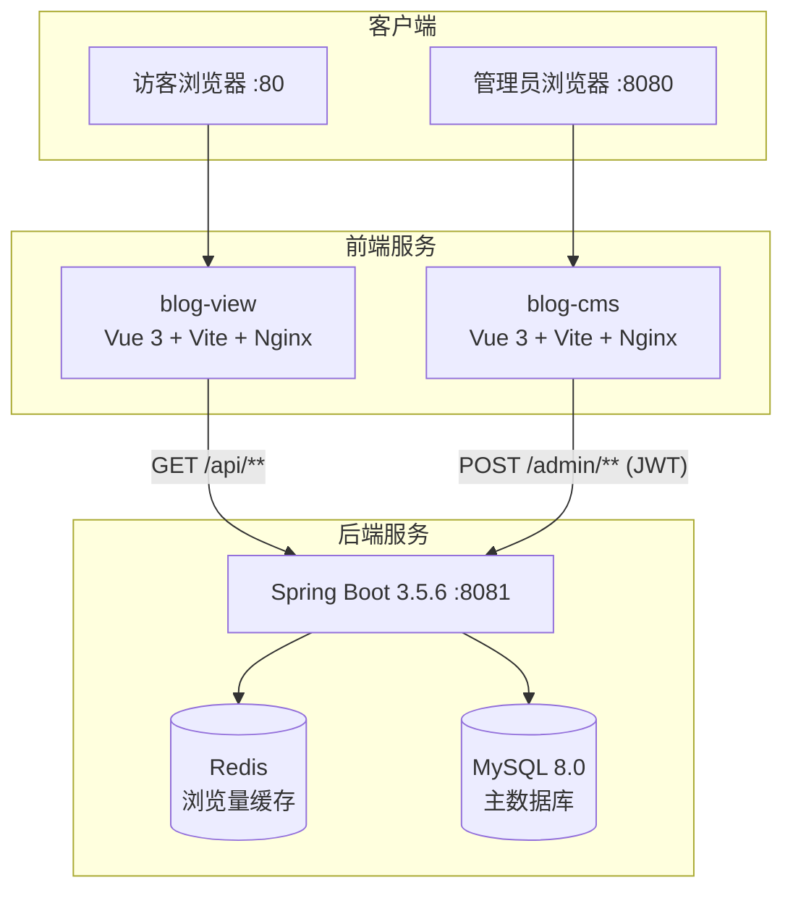
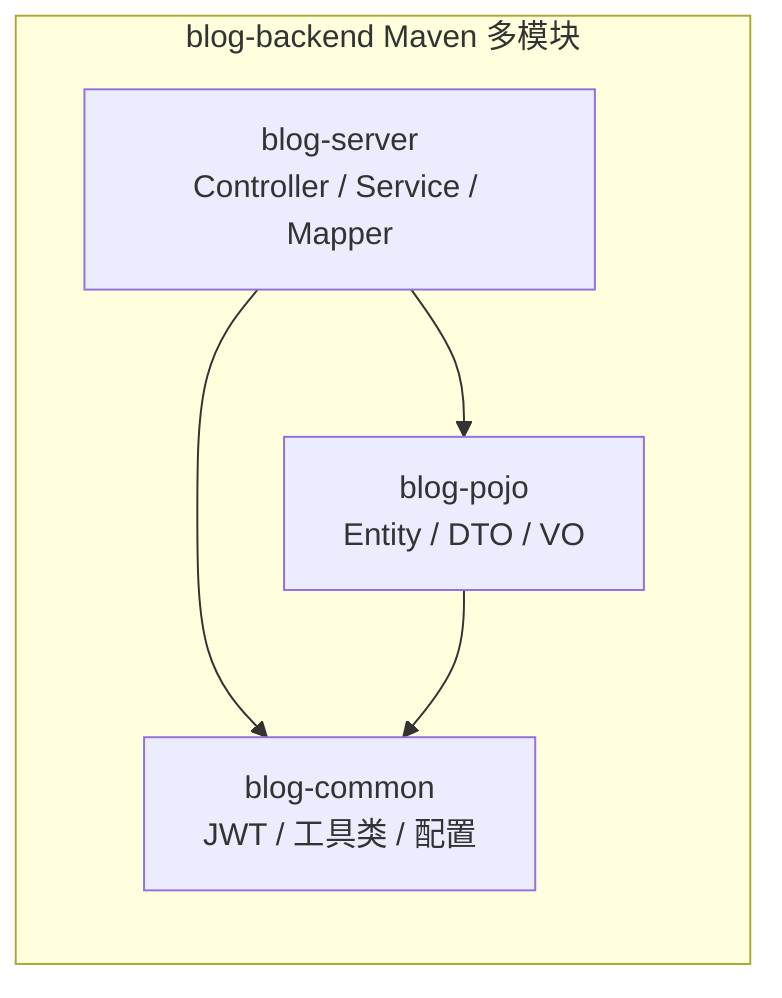
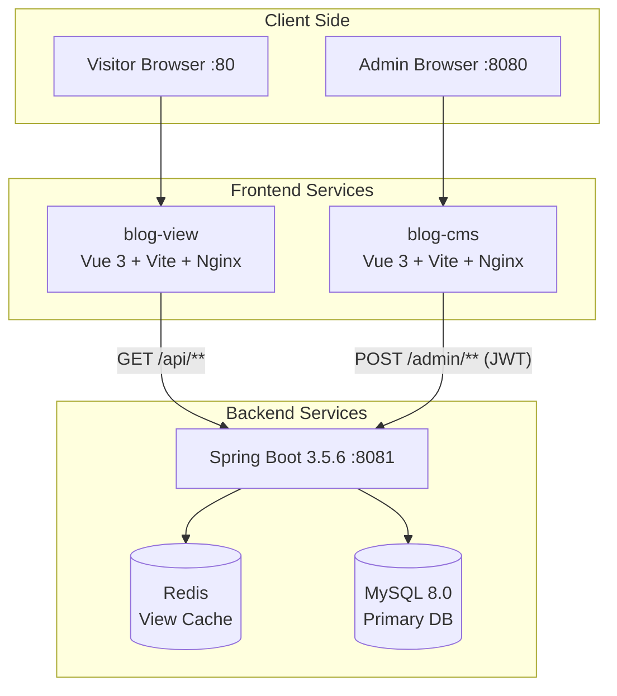
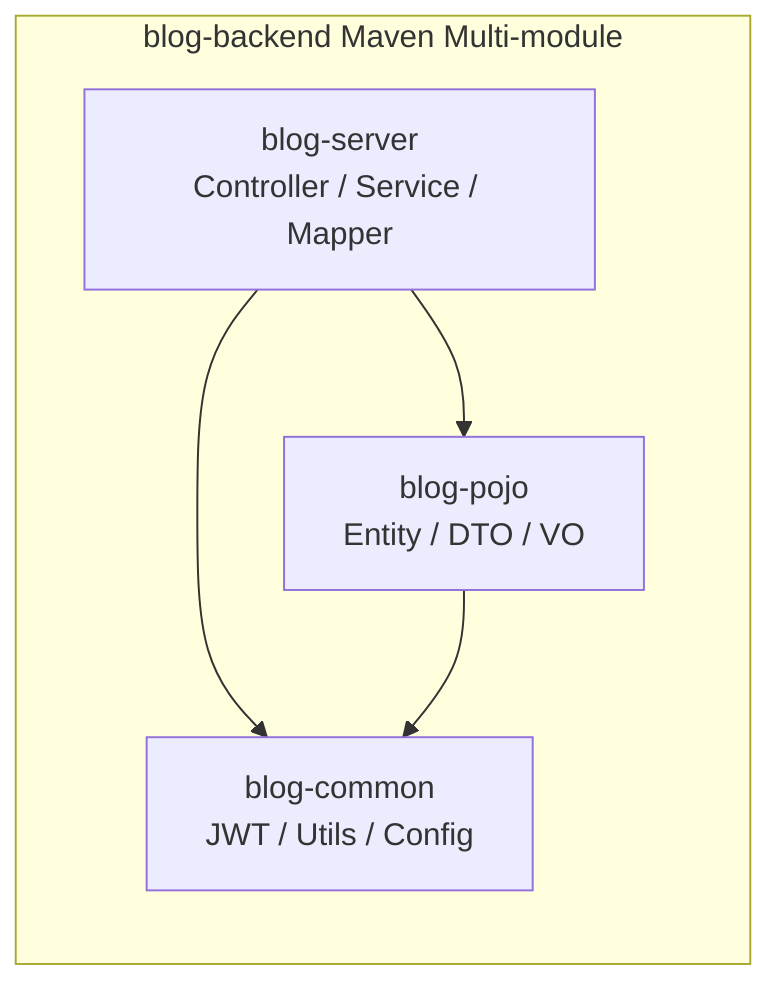

<div align="center">
# Eleven Blog

**一个以简约为主的个人主题博客系统**
**A minimal, elegant personal blog system built with Spring Boot & Vue 3**

[](https://openjdk.org/)
[](https://spring.io/projects/spring-boot)
[](https://vuejs.org/)
[](https://www.mysql.com/)
[](LICENSE)

</div>

---

<p align="center">
<strong>🌐 切换语言 / Switch Language：</strong>
<kbd><a href="#chinese">🇨🇳 中文</a></kbd> ·
<kbd><a href="#english">🇬🇧 English</a></kbd>
</p>

---

<br/>

<details open id="chinese">
<summary><strong>🇨🇳 中文文档（点击展开/折叠）</strong></summary>

<br/>

## 截图展示

<div align="center">

### 博客前台


### 后台管理


</div>

## 项目简介

Eleven Blog 是一个全栈个人博客平台，包含**博客前台**、**后台管理 CMS** 和 **RESTful API 后端**。支持 Markdown 文章发布、评论管理、动态（短文）、友链管理、分类与标签，以及带交互式图表的统计仪表盘。

## 功能特性

| 功能 | 说明 |
| :--- | :--- |
| 文章管理 | Markdown 编辑器撰写、编辑、发布/草稿文章，支持封面图、分类与标签 |
| 评论系统 | 嵌套评论，支持邮箱、网站、头像；后台审核管理 |
| 动态 | 类似推特的短文发布，支持图片附件 |
| 分类与标签 | 多维度分类；基于标签的文章筛选 |
| 友链管理 | 博客友情链接管理，支持 Logo 和描述 |
| 文件上传 | 图片上传，支持存储卷挂载 |
| 数据仪表盘 | 统计卡片、贡献热力图、分类饼图、标签旭日图 |
| 身份认证 | 基于 JWT 的无状态认证，支持 access/refresh token 轮换 |
| 浏览量统计 | 基于 Redis 的浏览量计数（IP 去重），定时同步到 MySQL |
| 深色/浅色主题 | 主题切换，持久化偏好设置 |
| 归档时间线 | 按时间线浏览文章归档 |
| Docker 部署 | Docker Compose 一键部署（5 个服务） |

## 架构图





## 技术栈

<table>
<tr>
<th width="33%">后端</th>
<th width="33%">前端</th>
<th width="33%">基础设施</th>
</tr>
<tr>
<td>

- Java 21
- Spring Boot 3.5.6
- Spring Security + JWT
- MyBatis 3.0.5
- MySQL 8.0
- Redis
- PageHelper
- Lombok

</td>
<td>

- Vue 3.5
- Vite 7.3
- Element Plus 2.13
- Pinia 3
- Vue Router 4
- md-editor-v3
- ECharts 6 (CMS)
- Axios

</td>
<td>

- Docker Compose
- Nginx（反向代理）
- MySQL 8.0 容器
- Redis Alpine 容器
- 数据卷持久化
- 健康检查

</td>
</tr>
</table>

## 快速开始

### 环境要求

- Java 21+
- Node.js 20.19+ 或 22.12+
- MySQL 8.0
- Redis

### 方式一：Docker Compose（推荐）

```bash
git clone https://github.com/your-username/Eleven-blog.git
cd Eleven-blog
docker compose up -d
```

| 服务 | 端口 | 说明 |
| :--- | :--- | :--- |
| `blog-view` | `:80` | 博客前台 |
| `blog-cms` | `:8080` | 后台管理 |
| `blog-backend` | `:8081` | REST API |
| `mysql_db` | 内部 | 数据库 |
| `redis` | 内部 | 缓存 |

### 方式二：本地开发

**1. 数据库初始化**

```bash
mysql -u root -p
CREATE DATABASE eleven_blog DEFAULT CHARACTER SET utf8mb4 COLLATE utf8mb4_unicode_ci;
USE eleven_blog;
SOURCE sql/init.sql;
```

**2. 启动后端**

```bash
cd blog-backend
# 修改 src/main/resources/application.yml 中的数据库和 Redis 连接信息
mvn clean package -DskipTests
java -jar blog-server/target/blog-server-1.0-SNAPSHOT.jar
```

**3. 启动博客前台**

```bash
cd blog-view
npm install
# 修改 .env 配置 VITE_APP_API_URL
npm run dev     # 开发模式
npm run build   # 生产构建
```

**4. 启动后台管理**

```bash
cd blog-cms
npm install
# 修改 .env 配置 VITE_APP_API_URL
npm run dev     # 开发模式 :8080
npm run build   # 生产构建
```

## 项目结构

```
Eleven-blog/
├── blog-backend/                    # Spring Boot 后端（Maven 多模块）
│   ├── blog-common/                 #   公共模块：JWT、工具类、Security 配置
│   ├── blog-pojo/                   #   数据层：Entity、DTO、VO
│   ├── blog-server/                 #   核心模块：Controller、Service、Mapper（启动入口）
│   ├── Dockerfile
│   └── pom.xml
├── blog-view/                       # 博客前台（Vue 3 + Vite）
│   ├── src/
│   │   ├── api/                     #   API 请求模块
│   │   ├── components/              #   可复用组件（ArticleCard、CommentsCard 等）
│   │   ├── views/                   #   页面（Home、ArticleDetail、Archive 等）
│   │   ├── router/                  #   Vue Router 路由配置
│   │   ├── store/ & stores/         #   Pinia 状态管理（auth、theme）
│   │   ├── utils/                   #   Axios 实例
│   │   └── assets/                  #   SCSS 主题、图片
│   ├── Dockerfile
│   ├── nginx.conf
│   └── vite.config.js
├── blog-cms/                        # 后台管理系统（Vue 3 + Vite）
│   ├── src/
│   │   ├── api/                     #   管理 API 模块
│   │   ├── components/              #   仪表盘图表、表单、表格组件
│   │   ├── views/                   #   管理页面（Dashboard、ArticleMgmt 等）
│   │   ├── router/                  #   带权限守卫的路由配置
│   │   ├── store/                   #   Pinia 认证状态管理
│   │   ├── composables/             #   useTable、useFormat 组合式函数
│   │   └── utils/                   #   Axios（自动刷新 Token）
│   ├── Dockerfile
│   ├── nginx.conf
│   └── vite.config.js
├── sql/
│   └── init.sql                     # 数据库初始化脚本
├── upload_data/                     # 文件上传目录（Docker 挂载卷）
├── docker-compose.yml               # 全栈编排配置
└── README.md
```

## API 示例

### 公开接口（`/api/**`）— 无需认证

```bash
# 获取已发布文章列表（分页）
GET /api/articles?page=1&pageSize=10

# 获取单篇文章
GET /api/articles/{id}

# 获取归档时间线
GET /api/archive

# 获取分类列表
GET /api/categories

# 获取标签列表
GET /api/tags

# 发表评论
POST /api/comments
Content-Type: application/json
{
  "nickname": "访客",
  "email": "guest@example.com",
  "content": "很棒的文章！",
  "blogId": 1,
  "parentCommentId": null
}
```

### 管理接口（`/admin/**`）— 需要 JWT

```bash
# 登录
POST /admin/auth/login
{ "username": "admin", "password": "password" }

# 响应
{
  "code": 1,
  "msg": "success",
  "data": {
    "accessToken": "eyJhbGci...",
    "refreshToken": "eyJhbGci..."
  }
}

# 创建文章
POST /admin/articles
Authorization: Bearer eyJhbGci...
{
  "title": "我的第一篇文章",
  "content": "# 你好世界\nMarkdown 内容...",
  "categoryId": 1,
  "tags": "1,2,3",
  "status": 1
}
```

## 数据库设计

| 表名 | 说明 |
| :--- | :--- |
| `article` | 文章（Markdown，状态：草稿/已发布/已删除） |
| `category` | 分类 |
| `tags` | 标签 |
| `comment` | 嵌套评论（含审核） |
| `moment` | 动态短文（含图片） |
| `friend_link` | 友情链接 |

## 路线图

- [ ] 全文搜索（Elasticsearch 集成）
- [ ] 新评论邮件通知
- [ ] RSS / Atom 订阅源
- [ ] 多语言（i18n）支持
- [ ] 文章系列/合集功能
- [ ] 社交媒体 OAuth 登录
- [ ] Sitemap 自动生成
- [ ] 图片 CDN 集成
- [ ] 自动化 CI/CD 流水线
- [ ] 单元测试与集成测试

## 贡献指南

1. **Fork** 本仓库
2. **创建** 功能分支（`git checkout -b feature/amazing-feature`）
3. **提交** 更改（`git commit -m 'Add amazing feature'`）
4. **推送** 分支（`git push origin feature/amazing-feature`）
5. **发起** Pull Request

### 开发规范

- 遵循各子项目现有代码风格
- 后端：Java 21 规范，Spring Boot 最佳实践
- 前端：Vue 3 组合式 API，Element Plus 组件
- 提交前请测试你的更改

## 许可证

本项目基于 MIT 许可证开源。

---

<div align="center">

**如果这个项目对你有帮助，请给个 Star ⭐ 吧！**

</div>

</details>

---

<br/>

<details id="english">
<summary><strong>🇬🇧 English Documentation（Click to expand/collapse）</strong></summary>

<br/>

## Screenshots

<div align="center">

### Public Blog


 

### Admin Panel


</div>

## Overview

Eleven Blog is a full-stack personal blog platform featuring a **public-facing blog**, an **admin CMS**, and a **RESTful API backend**. It supports article publishing with Markdown, comment management, moments (short posts), friend links, categories & tags, and a statistics dashboard with interactive charts.

## Features

| Feature | Description |
| :--- | :--- |
| Article Management | Write, edit, publish/draft articles with Markdown editor, cover images, categories & tags |
| Comment System | Nested comments with email, website, avatar support; admin moderation |
| Moments | Twitter-style short posts with image attachments |
| Categories & Tags | Multi-level categorization; tag-based article filtering |
| Friend Links | Blogroll management with logos and descriptions |
| File Upload | Image upload with storage volume support |
| Dashboard | Statistics cards, contribution heatmap, category pie chart, tag sunburst chart |
| Authentication | JWT-based stateless auth with access/refresh token rotation |
| View Counter | Redis-based view counting with IP dedup, periodic MySQL sync |
| Dark/Light Theme | Theme toggle with persistent preference |
| Archive Timeline | Chronological article archive view |
| Docker Deployment | One-command deployment with Docker Compose (5 services) |

## Architecture





## Tech Stack

<table>
<tr>
<th width="33%">Backend</th>
<th width="33%">Frontend</th>
<th width="33%">Infrastructure</th>
</tr>
<tr>
<td>

- Java 21
- Spring Boot 3.5.6
- Spring Security + JWT
- MyBatis 3.0.5
- MySQL 8.0
- Redis
- PageHelper
- Lombok

</td>
<td>

- Vue 3.5
- Vite 7.3
- Element Plus 2.13
- Pinia 3
- Vue Router 4
- md-editor-v3
- ECharts 6 (CMS)
- Axios

</td>
<td>

- Docker Compose
- Nginx (Reverse Proxy)
- MySQL 8.0 Container
- Redis Alpine Container
- Volume Persistence
- Health Checks

</td>
</tr>
</table>

## Getting Started

### Prerequisites

- Java 21+
- Node.js 20.19+ or 22.12+
- MySQL 8.0
- Redis

### Option A: Docker Compose (Recommended)

```bash
git clone https://github.com/your-username/Eleven-blog.git
cd Eleven-blog
docker compose up -d
```

| Service | Port | Description |
| :--- | :--- | :--- |
| `blog-view` | `:80` | Public blog |
| `blog-cms` | `:8080` | Admin panel |
| `blog-backend` | `:8081` | REST API |
| `mysql_db` | Internal | Database |
| `redis` | Internal | Cache |

### Option B: Local Development

**1. Database Setup**

```bash
mysql -u root -p
CREATE DATABASE eleven_blog DEFAULT CHARACTER SET utf8mb4 COLLATE utf8mb4_unicode_ci;
USE eleven_blog;
SOURCE sql/init.sql;
```

**2. Backend**

```bash
cd blog-backend
# Edit src/main/resources/application.yml with your DB/Redis credentials
mvn clean package -DskipTests
java -jar blog-server/target/blog-server-1.0-SNAPSHOT.jar
```

**3. Frontend — Blog View**

```bash
cd blog-view
npm install
# Edit .env to set VITE_APP_API_URL
npm run dev     # Development mode
npm run build   # Production build
```

**4. Frontend — Admin CMS**

```bash
cd blog-cms
npm install
# Edit .env to set VITE_APP_API_URL
npm run dev     # Development at :8080
npm run build   # Production build
```

## Project Structure

```
Eleven-blog/
├── blog-backend/                    # Spring Boot backend (Maven multi-module)
│   ├── blog-common/                 #   Shared utilities, JWT, Security config
│   ├── blog-pojo/                   #   Entity, DTO, VO classes
│   ├── blog-server/                 #   Controllers, Services, Mappers (entry point)
│   ├── Dockerfile
│   └── pom.xml
├── blog-view/                       # Public-facing blog (Vue 3 + Vite)
│   ├── src/
│   │   ├── api/                     #   API request modules
│   │   ├── components/              #   Reusable components (ArticleCard, CommentsCard, etc.)
│   │   ├── views/                   #   Pages (Home, ArticleDetail, Archive, etc.)
│   │   ├── router/                  #   Vue Router config
│   │   ├── store/ & stores/         #   Pinia stores (auth, theme)
│   │   ├── utils/                   #   Axios instance
│   │   └── assets/                  #   SCSS themes, images
│   ├── Dockerfile
│   ├── nginx.conf
│   └── vite.config.js
├── blog-cms/                        # Admin CMS (Vue 3 + Vite)
│   ├── src/
│   │   ├── api/                     #   Admin API modules
│   │   ├── components/              #   Dashboard charts, forms, tables
│   │   ├── views/                   #   Admin pages (Dashboard, ArticleMgmt, etc.)
│   │   ├── router/                  #   Protected route config
│   │   ├── store/                   #   Pinia auth store
│   │   ├── composables/             #   useTable, useFormat
│   │   └── utils/                   #   Axios with auto token refresh
│   ├── Dockerfile
│   ├── nginx.conf
│   └── vite.config.js
├── sql/
│   └── init.sql                     # Database initialization script
├── upload_data/                     # File upload storage (Docker volume)
├── docker-compose.yml               # Full stack orchestration
└── README.md
```

## API Examples

### Public API (`/api/**`) — No Auth Required

```bash
# Get published articles (paginated)
GET /api/articles?page=1&pageSize=10

# Get single article
GET /api/articles/{id}

# Get archive timeline
GET /api/archive

# Get categories
GET /api/categories

# Get tags
GET /api/tags

# Post a comment
POST /api/comments
Content-Type: application/json
{
  "nickname": "Guest",
  "email": "guest@example.com",
  "content": "Great article!",
  "blogId": 1,
  "parentCommentId": null
}
```

### Admin API (`/admin/**`) — JWT Required

```bash
# Login
POST /admin/auth/login
{ "username": "admin", "password": "password" }

# Response
{
  "code": 1,
  "msg": "success",
  "data": {
    "accessToken": "eyJhbGci...",
    "refreshToken": "eyJhbGci..."
  }
}

# Create article
POST /admin/articles
Authorization: Bearer eyJhbGci...
{
  "title": "My First Post",
  "content": "# Hello World\nMarkdown content...",
  "categoryId": 1,
  "tags": "1,2,3",
  "status": 1
}
```

## Database Schema

| Table | Description |
| :--- | :--- |
| `article` | Blog posts (Markdown, status: draft/published/deleted) |
| `category` | Categories |
| `tags` | Tags |
| `comment` | Nested comments with moderation |
| `moment` | Short-form posts with images |
| `friend_link` | Blogroll links |

## Roadmap

- [ ] Full-text search (Elasticsearch integration)
- [ ] Email notification for new comments
- [ ] RSS / Atom feed generation
- [ ] Multi-language (i18n) support
- [ ] Article series/collection feature
- [ ] Social media OAuth login
- [ ] Sitemap auto-generation
- [ ] Image CDN integration
- [ ] Automated CI/CD pipeline
- [ ] Unit & integration tests

## Contributing

1. **Fork** the repository
2. **Create** a feature branch (`git checkout -b feature/amazing-feature`)
3. **Commit** your changes (`git commit -m 'Add amazing feature'`)
4. **Push** to the branch (`git push origin feature/amazing-feature`)
5. **Open** a Pull Request

### Development Guidelines

- Follow existing code style in each sub-project
- Backend: Java 21 conventions, Spring Boot best practices
- Frontend: Vue 3 Composition API, Element Plus components
- Test your changes before submitting

## License

This project is licensed under the MIT License.

---

<div align="center">

**If you like this project, please consider giving it a star! ⭐**

</div>

</details>
