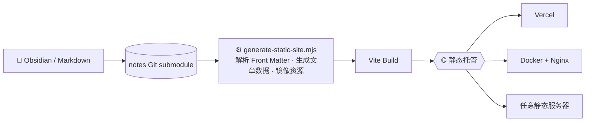
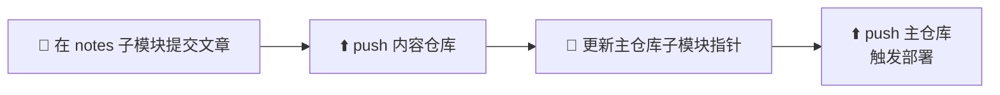

<div align="center">


[](https://github.com/Eleven-Mouse/Eleven-blog)

[](https://vuejs.org/)
[](https://vite.dev/)
[](https://pinia.vuejs.org/)
[](https://element-plus.org/)
[](https://nodejs.org/)
[](https://vercel.com/)
[](https://www.docker.com/)

[](https://github.com/Eleven-Mouse/Eleven-blog)
[](https://github.com/Eleven-Mouse/Eleven-blog/commits/main)
[](https://github.com/Eleven-Mouse/Eleven-blog)

**[English](README_EN.md) | 中文**

</div>

---

## 📖 这是什么？

> **Eleven Blog** 是一个「零后端」的静态个人博客：文章用 Obsidian / Markdown 书写，
> 存放在独立的 `notes` 仓库（Git submodule）中，构建阶段由 Node 脚本解析 Front Matter、
> 生成文章数据并镜像图片、附件、视频等资源，浏览器最终只访问静态 HTML / JSON。
>
> 没有数据库，没有 Redis，没有常驻服务 —— 推送即发布。✨

## ✨ 核心特性

| | 特性 | 说明 |
|:---:|:---|:---|
| 📝 | **本地内容优先** | `notes/` 目录是一个 Git 子模块，文章独立仓库管理 |
| 🔄 | **GitHub 内容回退** | 本地 `notes/` 为空时，构建脚本可从 GitHub 仓库拉取 Markdown |
| 🧩 | **智能解析** | YAML Front Matter、目录分类、数字前缀排序、标签自动识别 |
| 🖼 | **Obsidian 资源兼容** | 图片、附件、视频引用在构建时自动重写路径 |
| ⚡ | **按需加载** | 文章正文拆分为独立 JSON，首页不再一次性加载全部内容 |
| 💬 | **Giscus 评论** | 评论托管在 GitHub Discussions，零维护成本 |
| 🌗 | **亮暗双主题** | 亮色 / 暗色主题、归档、标签、分类、文章目录一应俱全 |
| 🚀 | **双部署方案** | Vercel 零后端部署，或 Docker + Nginx 自托管 |

## 🏗 架构总览


```mermaid
flowchart LR
    A[📝 Obsidian / Markdown] --> B[(notes Git submodule)]
    B --> C[⚙️ generate-static-site.mjs<br/>解析 Front Matter · 生成文章数据 · 镜像资源]
    C --> D[Vite Build]
    D --> E{{🌐 静态托管}}
    E --> F[Vercel]
    E --> G[Docker + Nginx]
    E --> H[任意静态服务器]
```

> 💡 如果本地 `notes` 目录为空，构建脚本也可以从 GitHub 仓库拉取 Markdown；
> 私有内容仓库建议在构建环境中提供只读 Token。

## 🚀 快速开始

### 环境要求


### 1️⃣ 克隆项目与内容子模块

```bash
git clone --recurse-submodules https://github.com/Eleven-Mouse/Eleven-blog.git
cd Eleven-blog/blog-view
```

<details>
<summary>📦 已克隆项目？补初始化子模块</summary>

```bash
git submodule update --init --recursive
```

</details>

### 2️⃣ 配置环境变量

项目已提供可用于本地预览的默认配置。需要个性化时，以 `.env.example` 为模板编辑 `.env.local`。

> ⚠️ 如果本地已存在 `.env.local`，不要直接覆盖，以免丢失 Vercel CLI 写入的本地凭据。

### 3️⃣ 启动开发环境

```bash
npm ci
npm run dev
```

```text
  ➜  Local:   http://localhost:3000/        ✨ 开发服务器就绪
```

> `npm run dev` 会先执行一次静态内容生成，然后启动 Vite。

### 4️⃣ 构建与预览

```bash
npm run build
npm run preview
```

构建产物位于 `blog-view/dist/`。

## ✍️ 内容工作流

内容目录是一个 Git 子模块：

```text
Eleven-blog/
└── blog-view/
    └── notes/    ->  https://github.com/Eleven-Mouse/Notes.git
```

文章目录按主题组织，**第一级目录默认作为分类**：

```text
notes/
├── 0-首页/
│   ├── 首页.md
│   └── cover.png
├── 3-存储层/
│   └── MySQL/
│       ├── 1-MVCC.md
│       └── 2-事务.md
└── 6-Agent/
    └── 1-Agent基础认知.md
```

### 发布流程


```mermaid
flowchart LR
    A[📝 在 notes 子模块提交文章] --> B[⬆️ push 内容仓库]
    B --> C[🔗 更新主仓库子模块指针]
    C --> D[⬆️ push 主仓库<br/>触发部署]
```

<details>
<summary>📋 对应的 Git 命令</summary>

```bash
# 先在内容仓库提交并推送
git -C blog-view/notes add .
git -C blog-view/notes commit -m "docs: add new article"
git -C blog-view/notes push

# 再更新主仓库记录的子模块指针
git add blog-view/notes
git commit -m "chore: update notes"
git push
```

</details>

### Front Matter

```yaml
---
title: Redis 持久化
category: 存储层
tags: [Redis, 持久化]
chapter_order: 4
reading_minutes: 12
summary: 对比 RDB、AOF 与混合持久化。
is_comment: true
---
```

> 💡 未填写 `title` 时使用文件名；未填写 `category` 时使用文件所在的第一级目录，
> 并自动去掉 `1-`、`02-` 这类排序前缀。

## ⚙️ 配置说明

环境变量示例位于 [`blog-view/.env.example`](blog-view/.env.example)。

| 变量 | 必需 | 说明 |
|:---|:---:|:---|
| `VITE_CONTENT_SOURCE` | ✅ | 固定为 `static` 时使用构建期静态数据 |
| `VITE_GISCUS_REPO` | ✅ | Giscus 所在仓库，格式为 `owner/repo` |
| `VITE_GISCUS_REPO_ID` | ✅ | GitHub 仓库 ID |
| `VITE_GISCUS_CATEGORY` | ✅ | Discussions 分类名称 |
| `VITE_GISCUS_CATEGORY_ID` | ✅ | Discussions 分类 ID |
| `VITE_GISCUS_MAPPING` | — | 评论映射方式，默认 `pathname` |
| `GITHUB_CONTENT_OWNER` | — | 内容仓库 owner，仅在未使用本地 `notes/` 时需要 |
| `GITHUB_CONTENT_REPO` | — | 内容仓库名 |
| `GITHUB_CONTENT_BRANCH` | — | 内容分支，默认 `main` |
| `GITHUB_CONTENT_ROOT` | — | 只读取仓库中的子目录 |
| `GITHUB_CONTENT_TOKEN` | — | 私有仓库或规避 API 限流时使用，**禁止暴露到浏览器** |
| `BLOG_STATIC_CONFIG_JSON` | — | 构建期写入的站点配置 JSON |

<details>
<summary>🗂 使用文件配置 GitHub 内容源（可选）</summary>

复制 [`blog-view/content.config.example.json`](blog-view/content.config.example.json)
为 `content.config.json` 即可。**环境变量优先于文件配置。**

</details>

## 📁 项目结构

```text
Eleven-blog/
├── blog-view/
│   ├── notes/                    # 📝 内容子模块
│   ├── public/
│   │   ├── content/              # 🔧 构建生成的公开内容与资源
│   │   ├── giscus-*.css          # 🎨 Giscus 主题
│   │   └── avatar.png
│   ├── scripts/
│   │   └── generate-static-site.mjs
│   ├── src/
│   │   ├── api/                  # 🔌 静态数据访问适配层
│   │   ├── components/
│   │   ├── content/              # 📚 静态内容读取
│   │   ├── stores/
│   │   ├── utils/
│   │   └── views/
│   ├── content.config.example.json
│   ├── .env.example
│   ├── vite.config.js
│   └── vercel.json
├── docker-compose.yml            # 🐳 可选的 Nginx 自托管
└── .env.example                  # Docker Compose 构建参数
```

## 🛳️ 部署

<details open>
<summary>▲ Vercel（推荐）</summary>

在 Vercel 项目设置中使用：

| 配置项 | 值 |
|:---|:---|
| Root Directory | `blog-view` |
| Install Command | `npm ci` |
| Build Command | `npm run build` |
| Output Directory | `dist` |

在 Vercel 中配置需要覆盖的环境变量，并确保构建环境能够访问内容子模块或 GitHub 内容仓库。

</details>

<details>
<summary>🐳 Docker + Nginx 自托管</summary>

Docker 构建会优先使用 `blog-view/notes/`。需要从 GitHub 拉取内容时，可先复制根目录环境变量模板：

```bash
cp .env.example .env
docker compose up -d --build
```

```text
  ➜  默认访问地址:  http://localhost:8080   （可通过 BLOG_PORT 修改端口）
```

</details>

## ⌨️ 常用命令

> 所有命令均在 `blog-view/` 下执行：

| 命令 | 说明 |
|:---|:---|
| `npm run dev` | 🔥 生成静态内容并启动 Vite 开发服务器 |
| `npm run build:content` | 📦 只生成文章数据和资源 |
| `npm run build` | 🏗 生成静态内容并构建生产包 |
| `npm run preview` | 👀 本地预览生产构建 |
| `npm run notes:date` | 🕐 补充文章发布时间 |
| `npm run lint` | 🧹 运行 ESLint |

## ⚠️ 说明

- `GITHUB_CONTENT_TOKEN` 只用于构建脚本，**不要添加 `VITE_` 前缀**
- `blog-view/notes` 是独立 Git 仓库，内容提交和主仓库子模块指针需要分别提交
- 公开仓库没有内置后台、数据库或服务端评论系统

---

<div align="center">


用 Markdown 记录 · 用 Git 发布 · 用静态拥抱速度

**[⬆ 回到顶部](#-这是什么)**

</div>
