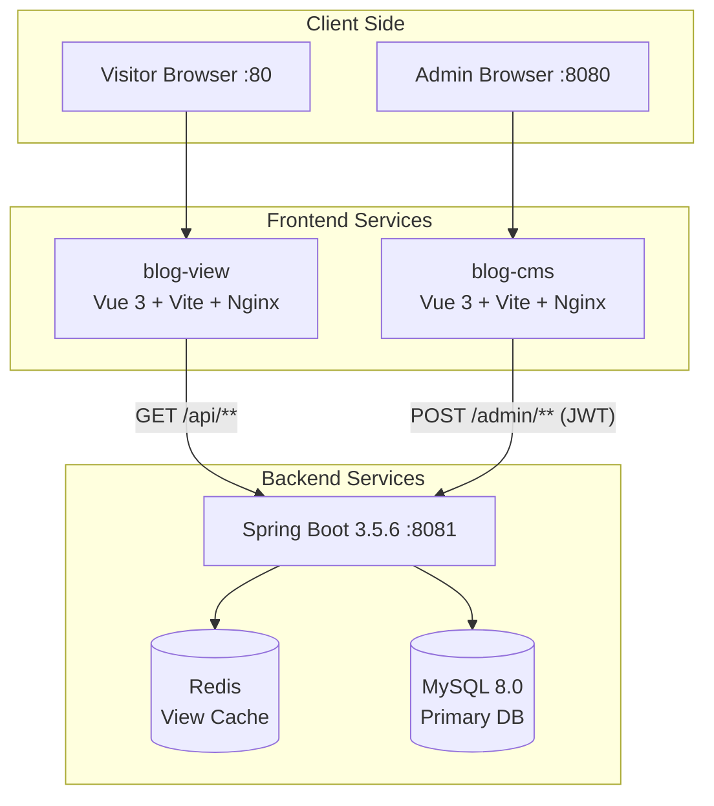
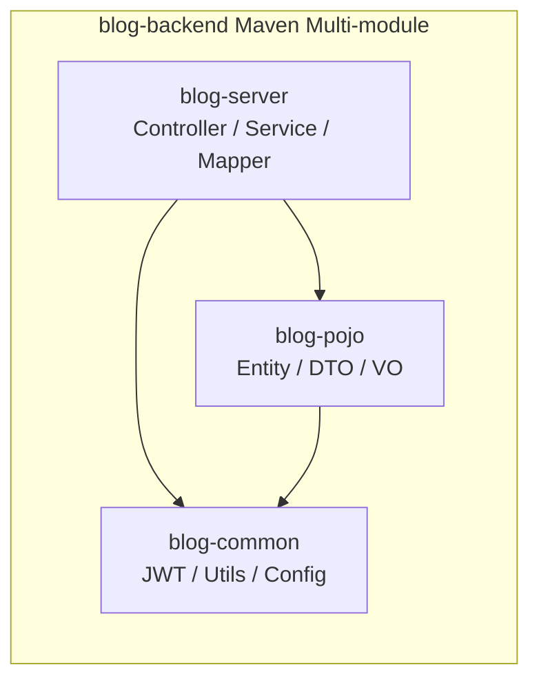

<div align="center">

# Eleven Blog

**A minimal, elegant personal blog system built with Spring Boot & Vue 3**

**English** | [**中文**](README.md)

</div>

> **Note:** This file provides a standalone English version. For a single-page bilingual experience with real-time language switching, please see [README.md](README.md).

---

## Screenshots

<div align="center">

### Public Blog


 

### Admin Panel


</div>

## Overview

Eleven Blog is a full-stack personal blog platform featuring a **public-facing blog**, an **admin CMS**, and a **RESTful API backend**. It supports article publishing with Markdown, comment management, moments (short posts), friend links, categories & tags, and a statistics dashboard with interactive charts.

## Features

| Feature | Description |
| :--- | :--- |
| Article Management | Write, edit, publish/draft articles with Markdown editor, cover images, categories & tags |
| Comment System | Nested comments with email, website, avatar support; admin moderation |
| Moments | Twitter-style short posts with image attachments |
| Categories & Tags | Multi-level categorization; tag-based article filtering |
| Friend Links | Blogroll management with logos and descriptions |
| File Upload | Image upload with storage volume support |
| Dashboard | Statistics cards, contribution heatmap, category pie chart, tag sunburst chart |
| Authentication | JWT-based stateless auth with access/refresh token rotation |
| View Counter | Redis-based view counting with IP dedup, periodic MySQL sync |
| Dark/Light Theme | Theme toggle with persistent preference |
| Archive Timeline | Chronological article archive view |
| Docker Deployment | One-command deployment with Docker Compose (5 services) |

## Architecture





## Tech Stack

<table>
<tr>
<th width="33%">Backend</th>
<th width="33%">Frontend</th>
<th width="33%">Infrastructure</th>
</tr>
<tr>
<td>

- Java 21
- Spring Boot 3.5.6
- Spring Security + JWT
- MyBatis 3.0.5
- MySQL 8.0
- Redis
- PageHelper
- Lombok

</td>
<td>

- Vue 3.5
- Vite 7.3
- Element Plus 2.13
- Pinia 3
- Vue Router 4
- md-editor-v3
- ECharts 6 (CMS)
- Axios

</td>
<td>

- Docker Compose
- Nginx (Reverse Proxy)
- MySQL 8.0 Container
- Redis Alpine Container
- Volume Persistence
- Health Checks

</td>
</tr>
</table>

## Getting Started

### Prerequisites

- Java 21+
- Node.js 20.19+ or 22.12+
- MySQL 8.0
- Redis

### Option A: Docker Compose (Recommended)

```bash
git clone https://github.com/your-username/Eleven-blog.git
cd Eleven-blog
docker compose up -d
```

| Service | Port | Description |
| :--- | :--- | :--- |
| `blog-view` | `:80` | Public blog |
| `blog-cms` | `:8080` | Admin panel |
| `blog-backend` | `:8081` | REST API |
| `mysql_db` | Internal | Database |
| `redis` | Internal | Cache |

### Option B: Local Development

**1. Database Setup**

```bash
mysql -u root -p
CREATE DATABASE eleven_blog DEFAULT CHARACTER SET utf8mb4 COLLATE utf8mb4_unicode_ci;
USE eleven_blog;
SOURCE sql/init.sql;
```

**2. Backend**

```bash
cd blog-backend
# Edit src/main/resources/application.yml with your DB/Redis credentials
mvn clean package -DskipTests
java -jar blog-server/target/blog-server-1.0-SNAPSHOT.jar
```

**3. Frontend — Blog View**

```bash
cd blog-view
npm install
# Edit .env to set VITE_APP_API_URL
npm run dev     # Development mode
npm run build   # Production build
```

**4. Frontend — Admin CMS**

```bash
cd blog-cms
npm install
# Edit .env to set VITE_APP_API_URL
npm run dev     # Development at :8080
npm run build   # Production build
```

## Project Structure

```
Eleven-blog/
├── blog-backend/                    # Spring Boot backend (Maven multi-module)
│   ├── blog-common/                 #   Shared utilities, JWT, Security config
│   ├── blog-pojo/                   #   Entity, DTO, VO classes
│   ├── blog-server/                 #   Controllers, Services, Mappers (entry point)
│   ├── Dockerfile
│   └── pom.xml
├── blog-view/                       # Public-facing blog (Vue 3 + Vite)
│   ├── src/
│   │   ├── api/                     #   API request modules
│   │   ├── components/              #   Reusable components (ArticleCard, CommentsCard, etc.)
│   │   ├── views/                   #   Pages (Home, ArticleDetail, Archive, etc.)
│   │   ├── router/                  #   Vue Router config
│   │   ├── store/ & stores/         #   Pinia stores (auth, theme)
│   │   ├── utils/                   #   Axios instance
│   │   └── assets/                  #   SCSS themes, images
│   ├── Dockerfile
│   ├── nginx.conf
│   └── vite.config.js
├── blog-cms/                        # Admin CMS (Vue 3 + Vite)
│   ├── src/
│   │   ├── api/                     #   Admin API modules
│   │   ├── components/              #   Dashboard charts, forms, tables
│   │   ├── views/                   #   Admin pages (Dashboard, ArticleMgmt, etc.)
│   │   ├── router/                  #   Protected route config
│   │   ├── store/                   #   Pinia auth store
│   │   ├── composables/             #   useTable, useFormat
│   │   └── utils/                   #   Axios with auto token refresh
│   ├── Dockerfile
│   ├── nginx.conf
│   └── vite.config.js
├── sql/
│   └── init.sql                     # Database initialization script
├── upload_data/                     # File upload storage (Docker volume)
├── docker-compose.yml               # Full stack orchestration
└── README.md
```

## API Examples

### Public API (`/api/**`) — No Auth Required

```bash
# Get published articles (paginated)
GET /api/articles?page=1&pageSize=10

# Get single article
GET /api/articles/{id}

# Get archive timeline
GET /api/archive

# Get categories
GET /api/categories

# Get tags
GET /api/tags

# Post a comment
POST /api/comments
Content-Type: application/json
{
  "nickname": "Guest",
  "email": "guest@example.com",
  "content": "Great article!",
  "blogId": 1,
  "parentCommentId": null
}
```

### Admin API (`/admin/**`) — JWT Required

```bash
# Login
POST /admin/auth/login
{ "username": "admin", "password": "password" }

# Response
{
  "code": 1,
  "msg": "success",
  "data": {
    "accessToken": "eyJhbGci...",
    "refreshToken": "eyJhbGci..."
  }
}

# Create article
POST /admin/articles
Authorization: Bearer eyJhbGci...
{
  "title": "My First Post",
  "content": "# Hello World\nMarkdown content...",
  "categoryId": 1,
  "tags": "1,2,3",
  "status": 1
}
```

## Database Schema

| Table | Description |
| :--- | :--- |
| `article` | Blog posts (Markdown, status: draft/published/deleted) |
| `category` | Categories |
| `tags` | Tags |
| `comment` | Nested comments with moderation |
| `moment` | Short-form posts with images |
| `friend_link` | Blogroll links |

## Roadmap

- [ ] Full-text search (Elasticsearch integration)
- [ ] Email notification for new comments
- [ ] RSS / Atom feed generation
- [ ] Multi-language (i18n) support
- [ ] Article series/collection feature
- [ ] Social media OAuth login
- [ ] Sitemap auto-generation
- [ ] Image CDN integration
- [ ] Automated CI/CD pipeline
- [ ] Unit & integration tests

## Contributing

1. **Fork** the repository
2. **Create** a feature branch (`git checkout -b feature/amazing-feature`)
3. **Commit** your changes (`git commit -m 'Add amazing feature'`)
4. **Push** to the branch (`git push origin feature/amazing-feature`)
5. **Open** a Pull Request

### Development Guidelines

- Follow existing code style in each sub-project
- Backend: Java 21 conventions, Spring Boot best practices
- Frontend: Vue 3 Composition API, Element Plus components
- Test your changes before submitting

## License

This project is licensed under the MIT License.

---

<div align="center">

**If you like this project, please consider giving it a star! ⭐**

</div>
