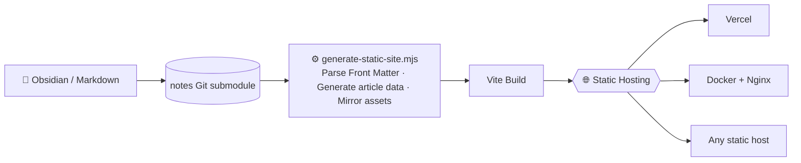
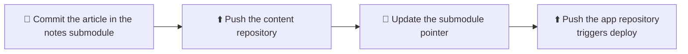

<div align="center">


[](https://github.com/Eleven-Mouse/Eleven-blog)

[](https://vuejs.org/)
[](https://vite.dev/)
[](https://pinia.vuejs.org/)
[](https://element-plus.org/)
[](https://nodejs.org/)
[](https://vercel.com/)
[](https://www.docker.com/)

[](https://github.com/Eleven-Mouse/Eleven-blog)
[](https://github.com/Eleven-Mouse/Eleven-blog/commits/main)
[](https://github.com/Eleven-Mouse/Eleven-blog)

English | **[中文](README.md)**

</div>

---

## 📖 What is this?

> **Eleven Blog** is a "zero-backend" static personal blog: articles are written in Obsidian / Markdown
> and stored in a separate `notes` repository (Git submodule). During the build, a Node script parses
> Front Matter, generates article data, and mirrors images, attachments, and videos — the browser
> only ever receives static HTML / JSON.
>
> No database, no Redis, no long-running service — push to publish. ✨

## ✨ Key Features

| | Feature | Description |
|:---:|:---|:---|
| 📝 | **Local content first** | The `notes/` directory is a Git submodule — articles live in their own repository |
| 🔄 | **GitHub content fallback** | When local `notes/` is empty, the build fetches Markdown from a GitHub repository |
| 🧩 | **Smart parsing** | YAML Front Matter, directory categories, numeric prefix sorting, and tags — all automatic |
| 🖼 | **Obsidian asset compatibility** | Image, attachment, and video references are rewritten at build time |
| ⚡ | **Lazy loading** | Article content is split into per-article JSON, so the home page never loads everything at once |
| 💬 | **Giscus comments** | Comments powered by GitHub Discussions — zero maintenance |
| 🌗 | **Light & dark themes** | Themes, archive, tags, categories, and article outline all included |
| 🚀 | **Dual deployment** | Zero-backend deploy on Vercel, or self-host with Docker + Nginx |

## 🏗 Architecture


```mermaid
flowchart LR
    A[📝 Obsidian / Markdown] --> B[(notes Git submodule)]
    B --> C[⚙️ generate-static-site.mjs<br/>Parse Front Matter · Generate article data · Mirror assets]
    C --> D[Vite Build]
    D --> E{{🌐 Static Hosting}}
    E --> F[Vercel]
    E --> G[Docker + Nginx]
    E --> H[Any static host]
```

> 💡 When the local `notes` directory is empty, the build can fetch Markdown from GitHub;
> for private content repositories, provide a read-only token in the build environment.

## 🚀 Getting Started

### Requirements


### 1️⃣ Clone the app and content submodule

```bash
git clone --recurse-submodules https://github.com/Eleven-Mouse/Eleven-blog.git
cd Eleven-blog/blog-view
```

<details>
<summary>📦 Already cloned? Initialize the submodule</summary>

```bash
git submodule update --init --recursive
```

</details>

### 2️⃣ Configure environment variables

The project includes defaults for local preview. For overrides, use `.env.example` as the template for `.env.local`.

> ⚠️ If `.env.local` already exists, do not overwrite it — it may contain Vercel CLI credentials.

### 3️⃣ Start development

```bash
npm ci
npm run dev
```

```text
  ➜  Local:   http://localhost:3000/        ✨ dev server ready
```

> `npm run dev` generates static content first, then starts Vite.

### 4️⃣ Build and preview

```bash
npm run build
npm run preview
```

The production output is written to `blog-view/dist/`.

## ✍️ Content Workflow

The content directory is a Git submodule:

```text
Eleven-blog/
└── blog-view/
    └── notes/    ->  https://github.com/Eleven-Mouse/Notes.git
```

Articles are organized by topic, and **the first directory level becomes the default category**:

```text
notes/
├── 0-首页/
│   ├── 首页.md
│   └── cover.png
├── 3-存储层/
│   └── MySQL/
│       ├── 1-MVCC.md
│       └── 2-事务.md
└── 6-Agent/
    └── 1-Agent基础认知.md
```

### Publishing flow


```mermaid
flowchart LR
    A[📝 Commit the article in the notes submodule] --> B[⬆️ Push the content repository]
    B --> C[🔗 Update the submodule pointer]
    C --> D[⬆️ Push the app repository<br/>triggers deploy]
```

<details>
<summary>📋 The Git commands behind it</summary>

```bash
# Commit and push the content repository first.
git -C blog-view/notes add .
git -C blog-view/notes commit -m "docs: add new article"
git -C blog-view/notes push

# Then update the submodule pointer in the app repository.
git add blog-view/notes
git commit -m "chore: update notes"
git push
```

</details>

### Front Matter

```yaml
---
title: Redis Persistence
category: Storage
tags: [Redis, Persistence]
chapter_order: 4
reading_minutes: 12
summary: Compare RDB, AOF, and hybrid persistence.
is_comment: true
---
```

> 💡 If `title` is omitted, the file name is used. If `category` is omitted, the first directory
> level is used after stripping numeric prefixes like `1-` or `02-`.

## ⚙️ Configuration

See [`blog-view/.env.example`](blog-view/.env.example) for the complete environment template.

| Variable | Required | Purpose |
|:---|:---:|:---|
| `VITE_CONTENT_SOURCE` | ✅ | Set to `static` to use build-time content |
| `VITE_GISCUS_REPO` | ✅ | Giscus repository in `owner/repo` format |
| `VITE_GISCUS_REPO_ID` | ✅ | GitHub repository ID |
| `VITE_GISCUS_CATEGORY` | ✅ | GitHub Discussions category name |
| `VITE_GISCUS_CATEGORY_ID` | ✅ | GitHub Discussions category ID |
| `VITE_GISCUS_MAPPING` | — | Comment mapping mode, defaults to `pathname` |
| `GITHUB_CONTENT_OWNER` | — | Content repository owner, used only without local `notes/` |
| `GITHUB_CONTENT_REPO` | — | Content repository name |
| `GITHUB_CONTENT_BRANCH` | — | Content branch, defaults to `main` |
| `GITHUB_CONTENT_ROOT` | — | Optional repository subdirectory |
| `GITHUB_CONTENT_TOKEN` | — | Read-only token for private repositories or higher API limits — **never expose it to the browser** |
| `BLOG_STATIC_CONFIG_JSON` | — | JSON configuration written into the generated site |

<details>
<summary>🗂 File-based GitHub content source (optional)</summary>

Copy [`blog-view/content.config.example.json`](blog-view/content.config.example.json)
to `content.config.json`. **Environment variables take precedence over file configuration.**

</details>

## 📁 Project Structure

```text
Eleven-blog/
├── blog-view/
│   ├── notes/                    # 📝 Content submodule
│   ├── public/
│   │   ├── content/              # 🔧 Generated public content and assets
│   │   ├── giscus-*.css          # 🎨 Giscus themes
│   │   └── avatar.png
│   ├── scripts/
│   │   └── generate-static-site.mjs
│   ├── src/
│   │   ├── api/                  # 🔌 Static data adapter
│   │   ├── components/
│   │   ├── content/              # 📚 Static content loader
│   │   ├── stores/
│   │   ├── utils/
│   │   └── views/
│   ├── content.config.example.json
│   ├── .env.example
│   ├── vite.config.js
│   └── vercel.json
├── docker-compose.yml            # 🐳 Optional Nginx self-hosting
└── .env.example                  # Docker Compose build variables
```

## 🛳️ Deployment

<details open>
<summary>▲ Vercel (recommended)</summary>

Use these project settings:

| Setting | Value |
|:---|:---|
| Root Directory | `blog-view` |
| Install Command | `npm ci` |
| Build Command | `npm run build` |
| Output Directory | `dist` |

Set any overrides in the Vercel dashboard and make sure the build environment can access the content submodule or GitHub content repository.

</details>

<details>
<summary>🐳 Docker + Nginx self-hosting</summary>

Docker uses `blog-view/notes/` when available. To fetch content from GitHub instead, copy the root environment template first:

```bash
cp .env.example .env
docker compose up -d --build
```

```text
  ➜  Default address:  http://localhost:8080   (change the port via BLOG_PORT)
```

</details>

## ⌨️ Commands

> Run all commands from `blog-view/`:

| Command | Purpose |
|:---|:---|
| `npm run dev` | 🔥 Generate content and start the Vite development server |
| `npm run build:content` | 📦 Generate article data and assets only |
| `npm run build` | 🏗 Generate content and build for production |
| `npm run preview` | 👀 Preview the production build locally |
| `npm run notes:date` | 🕐 Add publish timestamps to articles |
| `npm run lint` | 🧹 Run ESLint |

## ⚠️ Notes

- `GITHUB_CONTENT_TOKEN` is build-only — **do not prefix it with `VITE_`**
- `blog-view/notes` is a separate Git repository — commit content and the parent submodule pointer separately
- The project has no built-in admin, database, or server-side comments

---

<div align="center">


Write in Markdown · Publish with Git · Embrace static speed

**[⬆ Back to top](#-what-is-this)**

</div>
